# CG 2022/2023

## Group T03G01
| Name             | Number    |
| ---------------- | --------- |
| Carlos Sousa         | 202005954 |
| Rui Soares         | 202103631 |

## Project prints

| **MyPanoram-1**| **MyPanoram-2** |
| :-------------:| :-------------: |
| 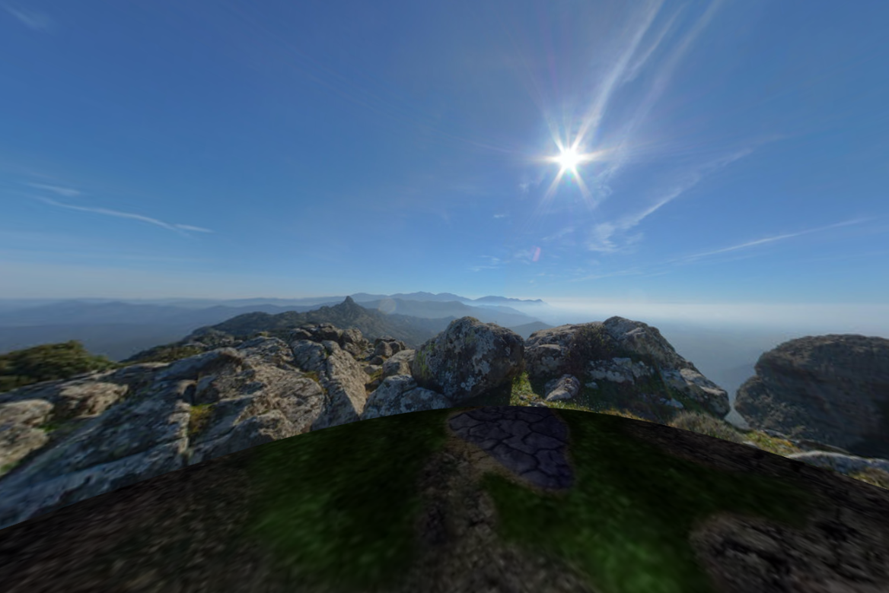 |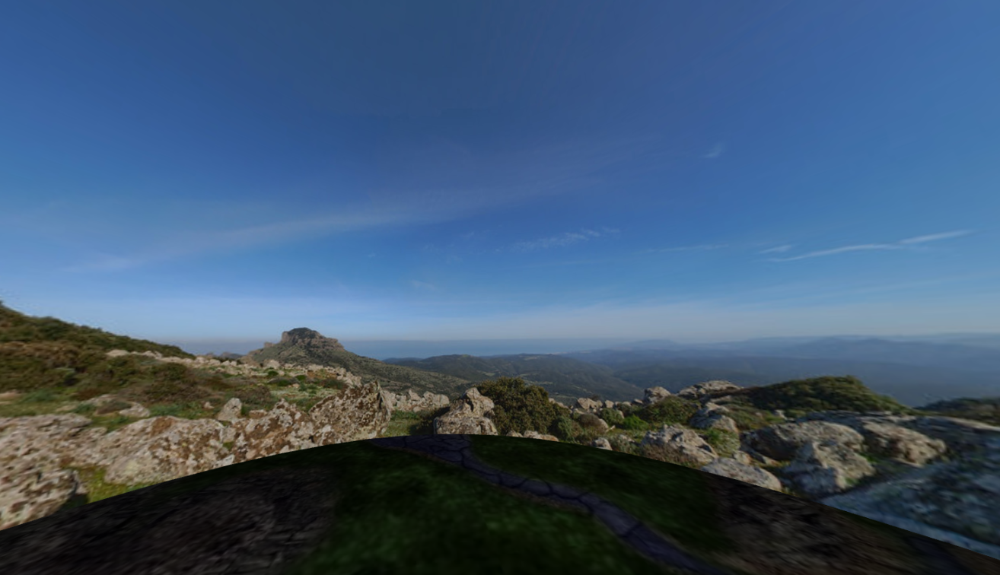 |

| **MyBird-1**| **MyBird-2** |
| :----------:| :----------: |
| 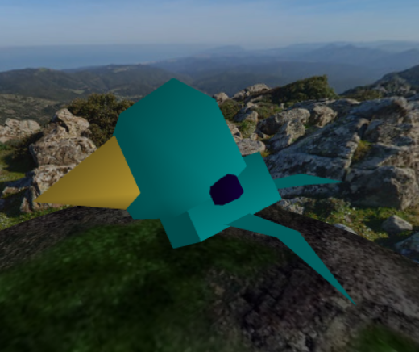 |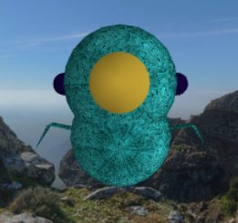 |

| **MyTerrain**|
| :-----------:|
| 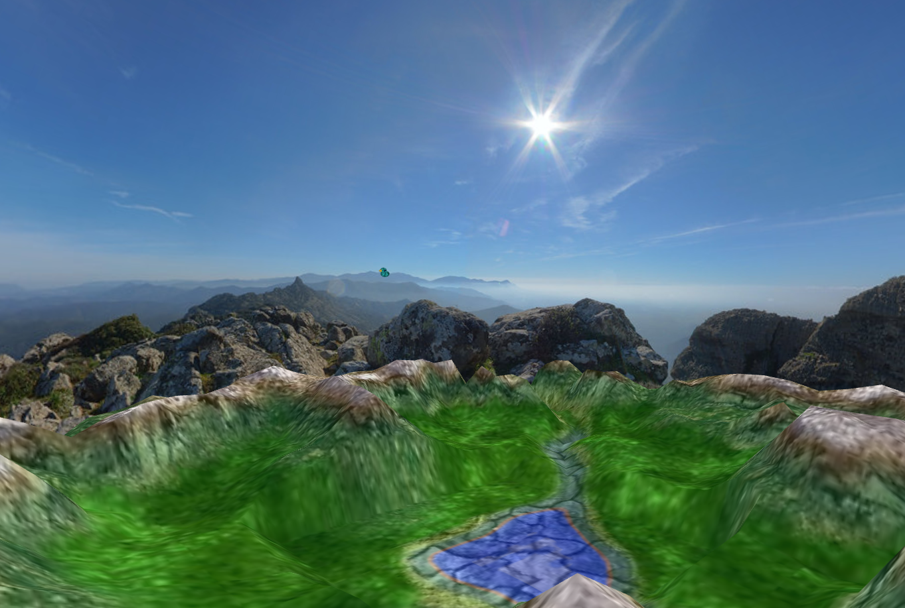 |

| **Egg** | **Nest** |
| :-----: | :--------:|
| 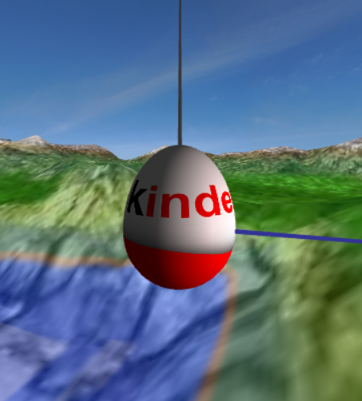 | 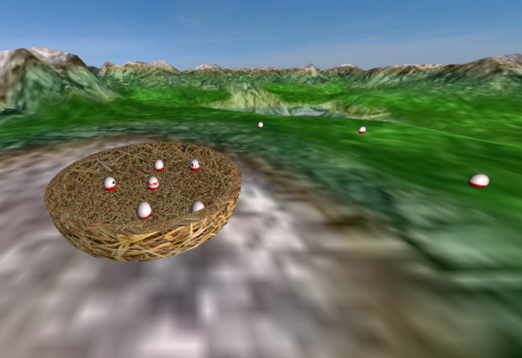 |

| **Bird Holding Egg** |
| :------------------: |
| 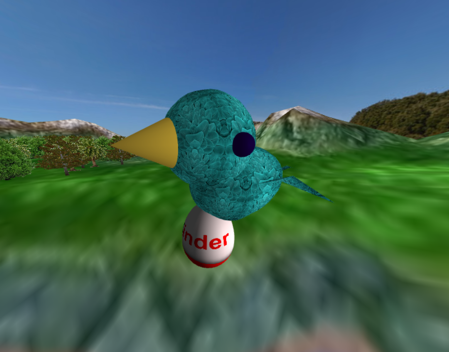

| **Group Patch** | **Row Patch** |
| :-----: | :--------:|
| 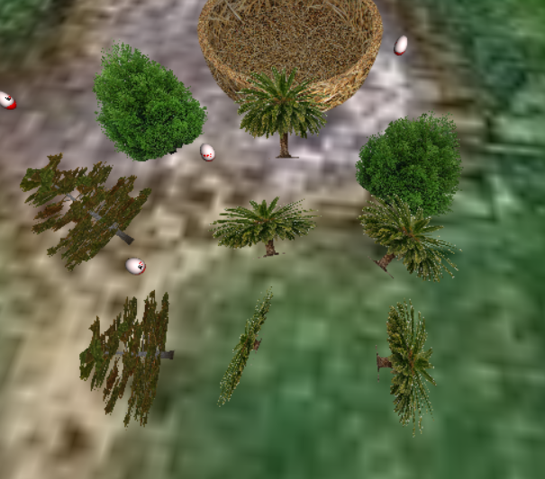 | 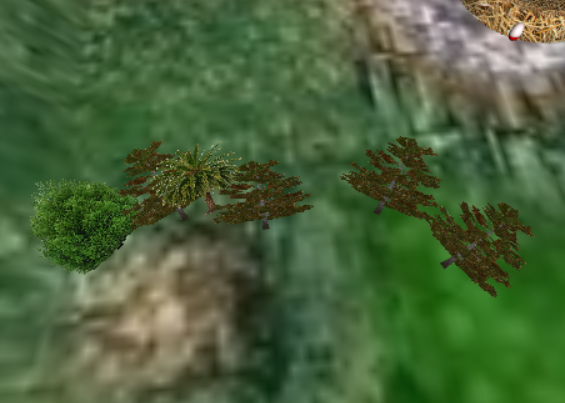 |

| **Complete Patch** |
| :------------------: |
| 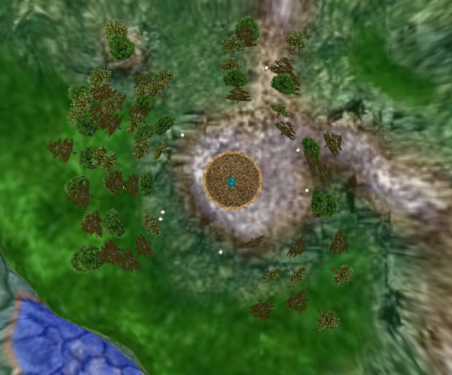 |

The trees used are the following:

| **Tree 1** |
| :------------------: |
| 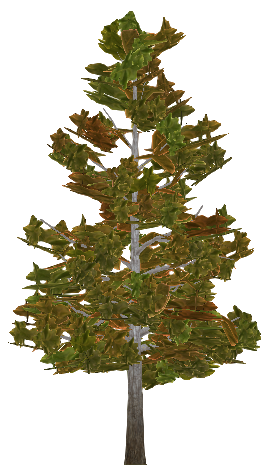 |
| Already available in the base project |

| **Tree 2** |
| :------------------: |
| 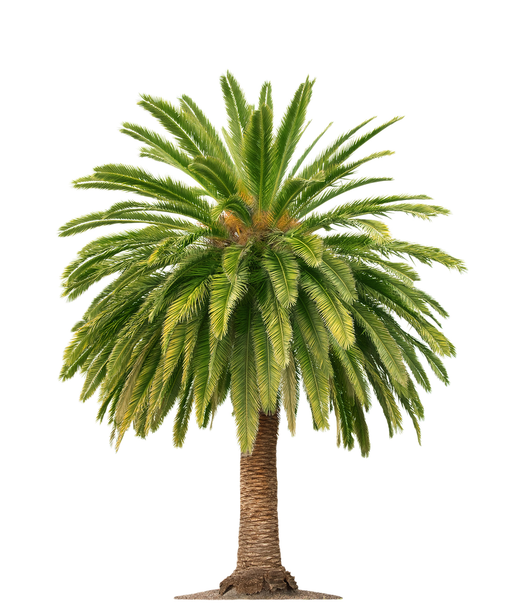 |
| [© Lev Kropotov, Shutterstock](https://www.collinsdictionary.com/pt/dictionary/english/palm). |

| **Tree 3** |
| :------------------: |
| 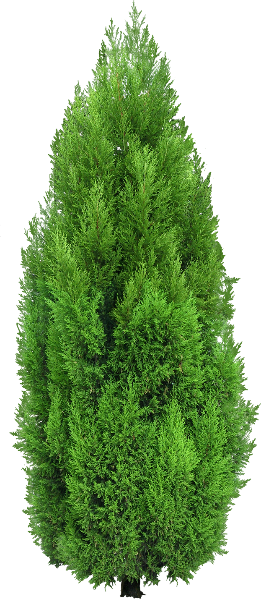 |
| Acquired from this [website](https://www.pngwing.com/pt/free-png-dxbsd). |

| **Egg Fall First Moment** | **Egg Fall Final Moment** |
| :-----------------------: | :-----------------------: |
| 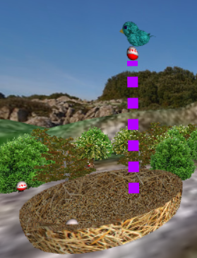 | 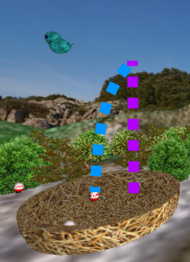 |

| **Egg Fall Momentum** | 
| :-------------------: |
| 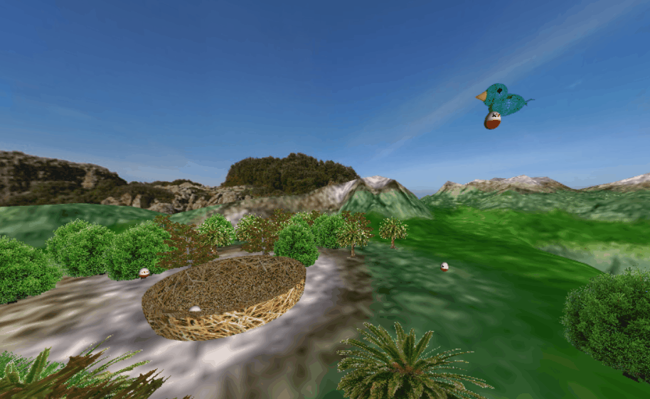 |

