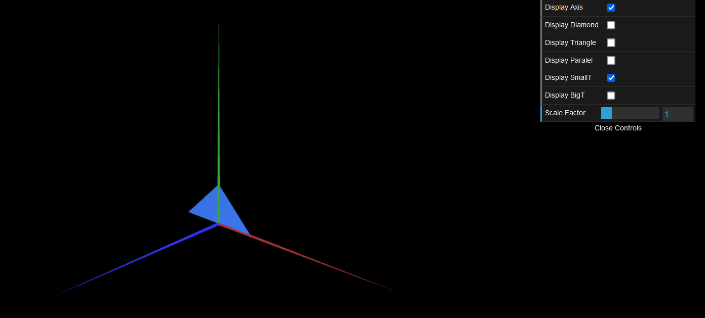

# CG 2022/2023

## Group T03G01

## TP 1 Notes

- In exercise 1 we observed that the order of the vertice references are important in order to achieve the correct result

  

    
    
  

| **Exercise 1.1**| **Exercise 1.2** |
| :----------:| :-------------------: |
|  | |

- In exercise 2 we observed that the order of the vertice references are important in order to achieve the correct result

| **Exercise 1.1**| **Exercise 1.2** |
| :----------:| :-------------------------------: |
|  ||

