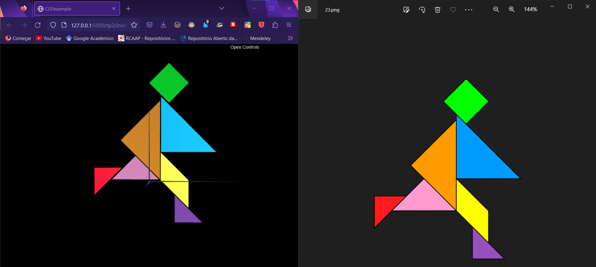
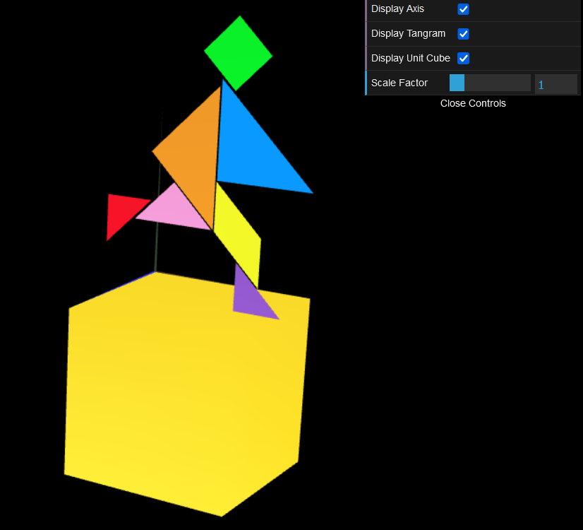
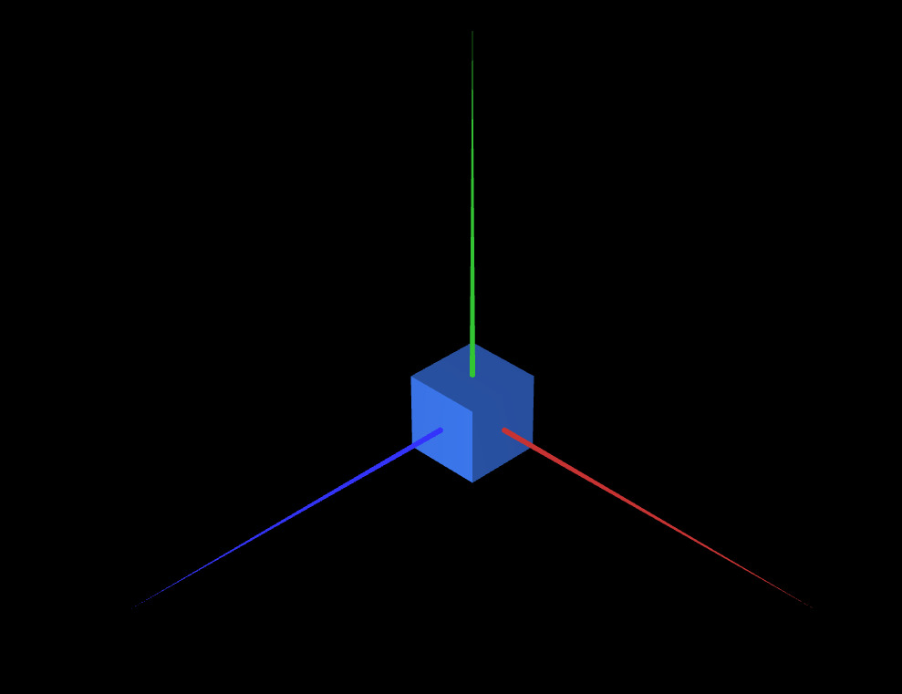

# CG 2022/2023

## Group T03G01

## TP 2 Notes

- In exercise 1, at the beginning it was difficult to visualize the faces of the cube because we were drawing the triangles counterclockwise.

| **Exercise 1**|
| :----------:| 
|  |

- In exercise 2, moving the cube to the requested position was a challenge, because we were initially doing the calculations wrong

| **Exercise 2**|
| :----------:|
|  | 

- In exercise 3, it was trivial

| **Exercise 3**|
| :----------:|
|  |

