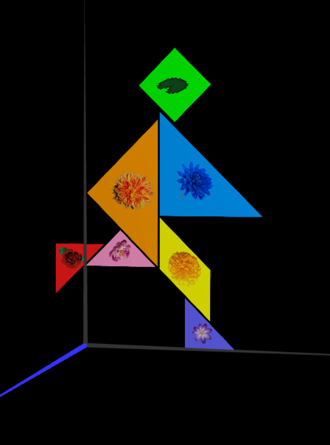
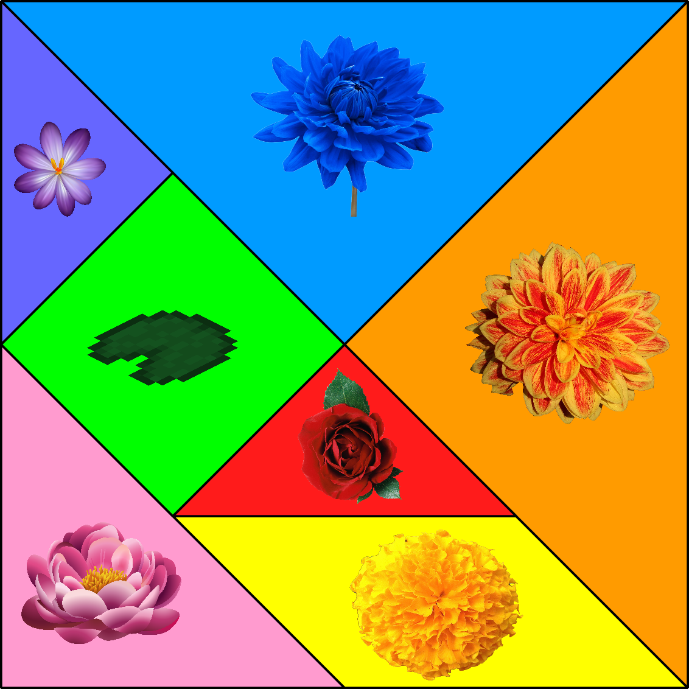

# CG 2022/2023

## Group T03G01

## TP 4 Notes

- In Exercise 1, we struggled with the texture coordinates in each figure. But using the [tangram-lines](images/tangram-lines.png) image, the task of figuring out the coordinates turned out to be easier than expected.
- To prove that the textures are placed correctly, we used an [image with flowers](images/tangram-flowers.png) in order to demonstrate the said correctness.

| **Exercise 1** | **Tangram Reference** |
| :----------:| :----------:|
|  |  |

